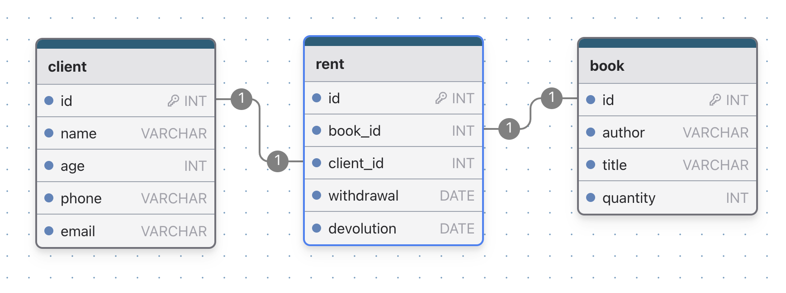

# Parte 1

**1 - O que é redundância de dados?**
A redundância de dados é a duplicação de elementos, e tem como finalidade manter cópias que podem ser acessadas como reservas quando ocorrer danos ou falhas, tanto nos componentes físicos quanto nos virtuais.

**2 - O que é inconsistência de dados?**
A inconsistência de dados ocorre quando há discrepâncias entre os valores registrados em diferentes fontes ou quando os dados não seguem as regras de validação estabelecidas.

**3 - Nomeie pelo menos 2 bancos de dados entre Consistência e Tolerância de Particionamento**
MongoDB e Redis.

**4 - O que significa SQL?**
Structed Query Language (Linguagem de Consulta Estruturada)

**5 - Em uma tabela de dados que é a Primary Key ou Chave Primária**
É uma coluna ou conjunto de colunas em uma tabela cujos valores identificam exclusivamente uma linha na tabela.

**6 - Em uma tabela de dados que é a Foreign Key ou Chave Estrangeira**
É uma coluna ou conjunto de colunas em uma tabela cujos valores correspondem aos valores da chave primária de outra tabela.

**7 - O que significa que um relacionamento entre duas entidades é UM para UM?**
Uma instância da entidade A está relacionada a uma e apenas uma da entidade B.

**8 - O que significa que um relacionamento entre duas entidades é UM para MUITOS?**
Cada instância da entidade A está relacionada a várias instâncias da entidade B.

**9 - O que significa que um relacionamento entre duas entidades é de MUITOS para MUITOS?**
Qualquer instância da entidade A está relacionada a qualquer instância da entidade B.

**10 - Defina o que é um banco de dados**
É um conjunto de dados que são armazenados em um determinado local e de forma organizada para serem consultados e utilizados de forma eficiente. Cada banco de dados é composto por uma ou mais tabelas que são responsáveis ​​por armazenar o conjunto de dados.  Cada tabela possui uma ou mais colunas e linhas, e a "interseção" entre as duas é considerada uma célula ou campo.

**11 - Defina o conceito de atributo**
São as propriedades que descrevem cada entidade em um conjunto de entidades.

# Parte 2

1 - Faça um diagrama de relacionamento de entidade para um sistema de aluguel de livros em uma biblioteca onde uma pessoa possa reservar mais de um livro. Implemente-o em um banco de dados.

2 - Melhore o diagrama entidade-relacionamento feito anteriormente, incorporando uma tabela intermediária de "aluguel" para gerenciar a data de aluguel e devolução dos livros a serem emprestados.



```
CREATE TABLE `client` (
	`id` INT NOT NULL AUTO_INCREMENT UNIQUE,
	`name` VARCHAR(255) NOT NULL,
	`age` INT NOT NULL,
	`phone` VARCHAR(255) NOT NULL,
	`email` VARCHAR(255) NOT NULL,
	PRIMARY KEY(`id`)
);

CREATE TABLE `rent` (
	`id` INT NOT NULL AUTO_INCREMENT UNIQUE,
	`book_id` INT NOT NULL,
	`client_id` INT NOT NULL,
	`withdrawal` DATE NOT NULL,
	`devolution` DATE NOT NULL,
	PRIMARY KEY(`id`)
);

CREATE TABLE `book` (
	`id` INT NOT NULL AUTO_INCREMENT UNIQUE,
	`author` VARCHAR(255),
	`title` VARCHAR(255) NOT NULL,
	`quantity` INT NOT NULL,
	PRIMARY KEY(`id`)
);

ALTER TABLE `rent`
ADD FOREIGN KEY(`client_id`) REFERENCES `client`(`id`)
ON UPDATE NO ACTION ON DELETE NO ACTION;
ALTER TABLE `rent`
ADD FOREIGN KEY(`book_id`) REFERENCES `book`(`id`)
ON UPDATE NO ACTION ON DELETE NO ACTION;
```